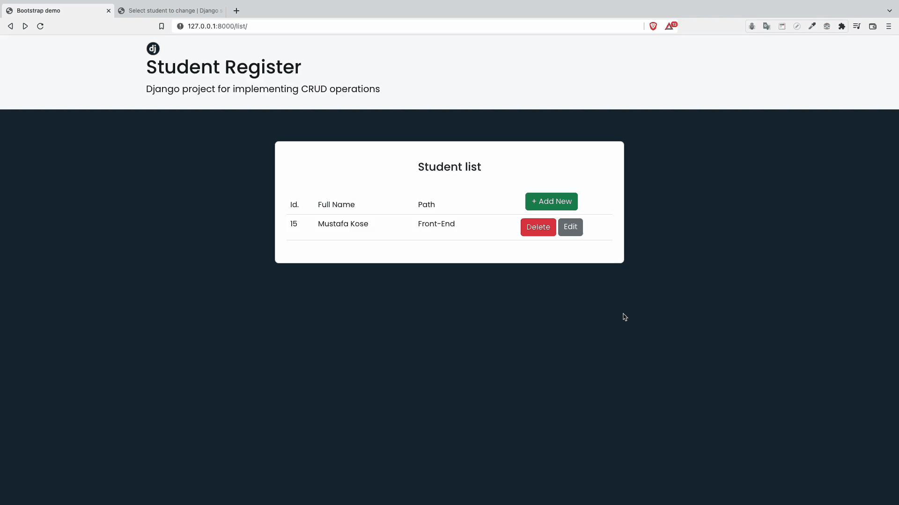

<h1 align="center">Django DRF Quiz API</h1>

## Table of Contents

- [Overview](#overview)
- [Stack & Tools](#stack)
- [How to use](#how-to-use)

## Overview

This project aims to apply CRUD  fucntionality with Django ORM and Django Template Language.



<h2 id="stack">Stack & Tools</h2>

- Django
- Bootstrap
- HTML
- CSS

## How To Use

```python
# Clone this repository
$ git clone https://github.com/MSKose/django-drf-quiz-api.git

# Install dependencies
    $ python -m venv env
    > env/Scripts/activate (for win OS)
    $ source env/bin/activate (for macOs/linux OS)
    $ pip install -r requirements.txt

# Add .env file
    add your SECRET_KEY in a .env file

# Run the app
    $ python manage.py runserver
```
